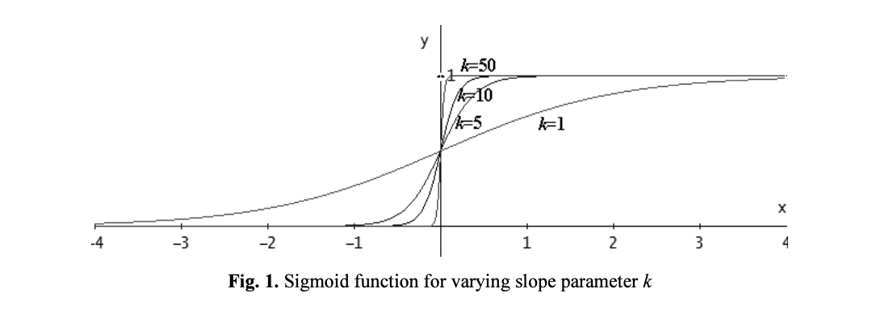

### Notes on Evaluating the software frameworks for developing Decentralized Autonomous Organizations

*Quotes & Comments*

> "In 2016, three DAO software frameworks —Aragon, Colony and DAOstack— emerged aiming to facilitate development and experimentation in this field. To which extent do they facilitate DAO development today?"

I am mainly interested in their design considerations.

> "Today (2020), problems include issues on software engineering, instability, localization, documentation, lack of formalization and standards, and interoperability. Complementarily, this paper aims to provide some guidance to those developers aiming to face the challenges in developing a DAO, and to those aiming to fix the major weak points that make DAOs the organizations of a still distant future."

> "A relevant feature of DAOs is that they operate without central control/management. That is, the participants of a DAO typically hold some voting power and can submit proposals that will be approved or rejected through several decision making mechanisms [2, 6]. Besides, as a decentralized organization, a DAO can 'provide services (or resources) to third-parties or even hire people to perform specific tasks. Hence, individuals can transact with a DAO in order to access its service, or get paid for their contributions.' [7]."

Good reference quote for educational (and/or marketing materials).

Reference:

[7]: Hassan, S. (2017). P2P Models white paper.   
Decentralized Blockchain-based Organizations for Bootstrapping the Collaborative Economy.  
<https://www.dropbox.com/s/c9lyx0r6lq3fw7p/whitepaper_p2pmodels.pdf?dl=0>  
(Retrieved April 16, 2021).

> "They (DAOs) have been discussed in Economics, Law, Organization Theory or Computer Science as a means to support non-hierarchical organizations that are concerned with ensuring sharing, security, transparency, and auditability, enabling global business models without a central authority or middle-man controlling them."

I believe this to be an extremely important point for anybody who has experienced financial pain through exploitation via middle-men. I personally know people who feel this way, however, they have <bold>no earthly idea</bold> what a DAO is. This <em>appeal to emotion</em> (a new, fair mechanism for implementation of buisness models) may be a good method of attracting people can easily see the up-side potential of these technologies.

> "In fact, there is a lack of both accepted standards and of widespread use cases of DAOs" (2020)

I know it's been discussed (at least briefly), are we aiming more so for experimentation or are we looking to do some <strong>serious 'standard setting'</strong>. A point of concern would be: when a project tries to accomplish too many things at once, it would seem to me to be (from my experience), more likely to fail. My humble opinion.

> "Each of the three frameworks described in this section has a different definition of DAO."

Requirement for standards.

> "Colony is a DAO framework based on a reputation system (i.e., decision power is weighted by the user reputation)."

Right, as I begun reading about DAOs, voting mechanisms was something I thought a lot about. My initial thoughts (before reading any papers) were to attempt to purpose a framework which generated a weighted graph based on interactions (of one kind or another) within the DAO. This view was re-inforced after reviewing the previous paper (Tangibly understanding intangible complexities: Designing for distributed autonomous organizations), as it would seem that DAOs with different purposes appear to give emergence to varying social network topologies. Thus, calculating clustering co-efficients (given the appropriate network topology) to measure the interconnectivity between members <em>could</em> be an appropriate parameter when calcuating proposal or/and voting weights, given each member (with some kind of identifier). These were just some initial thoughts and I have not considered them too seriously. An additional thought regarding weight calculations for voting power or proposal power would likely be required to be capped, but could be fit to a curve, for example:

Where k would be a preposed and voted upon parameter. However, upon reflection, variants of logistic functions or completely different curved functions may be appropriate. These were, however, my initial thoughts.

> "In DAOstack, decisions are initiated by proposals. The framework of DAOstack is composed of a set of several modules or layers [11]."

*Reference:  
DAOStack (2020).  
https://daostack.io/  
(Retrieved April 16, 2021).*

My intuition about how these technologies are modelled must have been **somewhat** *(or at least partially)* correct. As I created the following architectural diagram for a 'voting DAO' before starting any real research into these things (having some prior knowledge on what DAOs were, but not much; I thought perhaps they would have their own consensus protocol). See my naive model:

> "In this case, although the documentation in Aragon is well structured and defined, we suffered from a lack of references and support to tackle it for several issues."

> "The implementation of a DAO from scratch is a complex task for any organization."

Worth taking note of, at least.
