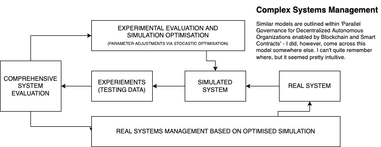

### Notes on Parallel Governance for Decentralized Autonomous Organizations enabled by Blockchain and Smart Contracts

*Note: Either I require more time to digest this paper or perhaps I have misunderstood elements of it; but it seems to me to be somewhat premature in its approach to creating potential 'parallel governance' models. I see where it is coming from, but it may be the case that the complexities associated with feature selection during the simulation stage of their ACP method are too difficult to conceptualise currently (without making further progress on standards surrounding DAOs). I may, however, be completely wrong. But it is stated within their abstract proposes further research as a conclusion, so, make of that what you will.*

*Quotes & Comments*

> "We consider that parallel governance represents the future trend of DAO research and practice. This paper is aimed at stimulating further effort and providing helpful guidance and reference for future research works."

> "The emergence of DAO brings various challenges to corporate governance theories and governance frameworks, including the dynamic changes of organization members and their power relationships, also changes of trust configuration model and work design in DAOs."

Highlighted, seemed relevant?

> "The key to controllable governance for DAOs is to structure an efficient set of consensus rules to resolve complex participant coordination problems [3]. Therefore, in cyber-physical-social systems with complex human behavior and group decisions, an effective governance way for the explanation, prediction, and prescription of online DAO requires the parallel DAO approach. This paper aims to construct a parallel governance framework for DAO based on the ACP approach and parallel intelligence theory to provide an effective solution for DAO controllable governance."

What exactly are complex participant co-ordination problems? Given a **network consensus** protocol, the only constraints that are required to be satisfied are those listed within the previous review (Termination, Agreement, Validity & Strong Validity - given an honest majority). I understand that this is a "cyber-physical-social system", but could we not take a subset of the constraints required to satisfy network consensus (i.e: all inputs must equal all outputs for an honest majority) and modify agreement insofar as agreement would be a majority agreement, or are there instances within these systems that create additional complexity which needs to be dealt with? As mentioned, I may seem this type of research is somewhat pre-mature? However, I am not an expert in these systems, so - who am I to comment?

I likely need to gain a better idea of the 'ACP approach' and parallel intelligence theory. **(ADD THIS TO: TODO)**.

**An Approach I Believe To Be 'ACP' Method (I can't find the original reference):**

**Additional research on references and on this paper in general is required to gain a better understanding of what exactly they've accomplished.**

*Next paper to review: DAO of DAOs! Loved reading this paper.*