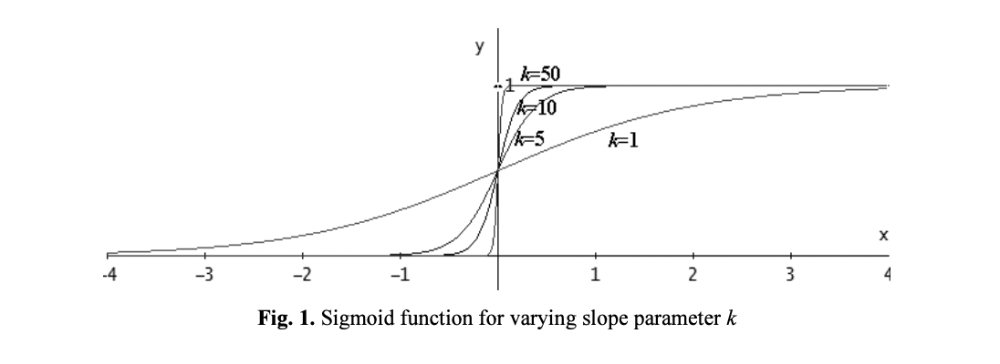
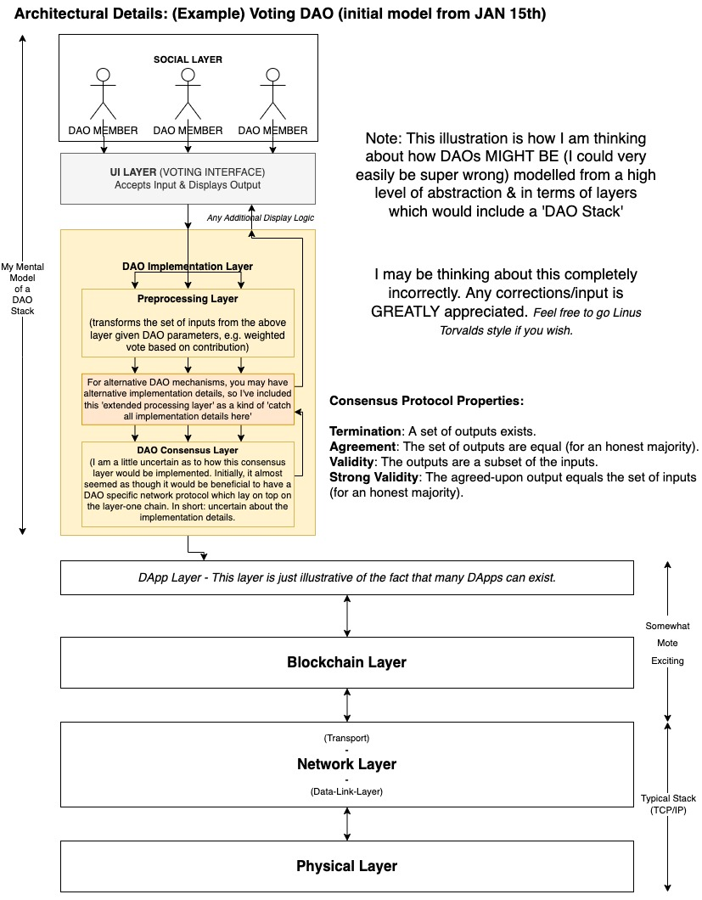
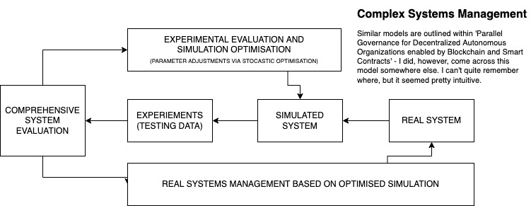

## Research on DAOs

*Performing a pseudo-academic literature review.*

**TODO**

* Make important (most appropriate notes) first.
* Read papers nine through thirteen.
* Make notes on all findings.
* Reference sociological and anthropological papers.
* Prepare notes and materials for Friday 22:00 UTC.
* Try and distribute some materials before hand.
* Scan in all annotated papers (there are more details within annotations).
* Review resources of interest in more depth.
* (OPTIONAL, not required by deadline) Prepare a pseudo-academic written literature review.
* Note: oppurtunities for further research.
* Prepare for meeting Saturday evening UTC 6PM.

**Timeframe:** 
 
* Initial deadline Friday afternoon UTC.  
* Extended deadline for further research: Saturday evening UTC 6PM.

[**Topics Covered Thus Far**](#topics)

[**Typed Notes (General) Thus Far**](#gnotes)

### Papers

*The ones towards the end may be of less importance or relevance.*

1. Tangibly understanding intangible complexities: Designing for distributed autonomous organizations -- *(read & annotated)*
2. Evaluating the software frameworks for developing Decentralized Autonomous Organizations -- *(read & annotated)*
3. Parallel Governance for Decentralized Autonomous Organizations enabled by Blockchain and Smart Contracts -- *(read & annotated)*
4. A Decentralized Autonomous Organization (DAO) of DAOs -- *(read & annotated)*
5. A Scalable Voting System: Validation of Holographic Consensus in DAOstack -- *(read & annotated)*
6. An Exploration of Governing via IT in Decentralized Autonomous Organizations -- *(read)*
7. Blockchain and Decentralised Autonomous Organisations (DAOs): the evolution of companies? -- *(read)*
8. Distributed Autonomous Organizations Modeling and Governance on the Perspective Wu-li Shi-li Ren-li Approach -- *(read)*
9. Foundations of Cryptoeconomic Systems
10. BLOCKCHAIN TECHNOLOGY: IS IT A CHAOTIC, COMPLEX SYSTEM?
11. Distributed Ledger Technology: State-of-the-Art and Current Challenges
11. BLOCKCHAIN GRAMMARS - DESIGNING WITH DAOS
12. Proof of Vote: A High-Performance Consensus Protocol Based on Vote Mechanism & Consortium Blockchain
13. Cryptourbanomics: A Method to Boost Urban Sustainability with Blockchain Technology
14. (BOOK) Blockchain and Applications

### Findings of Interest

**Topics Covered (in some degree of detail)**

*Some of the more sociological aspects are my own thoughts/potential (currently unformed) hypothesises regarding the collective behaviour of humans within DAOs of varying sizes and purposes. The DAO of DAOs paper was VERY informative.*

* DAOs (in general)
* DAO Applications
* Maintaining Decentralisation
* The Importance of Decentralisation
* Encapsulation Within Legal Frameworks (Jurisdictions)
* Path Dependencies (Conceptual Design Debt)
* The Importance Of Appropriate Layer One Architecture
* Supervisory Considerations (Community Audits)
* Incentive Design
* Poor Incentive Design
* The Notion Of Duality Of Incentives
* Voting Mechanisms
* Reputation Staking
* Merit Identifiers (NFTs VS Weighted Keys)
* Game-Theoretic Model Design Considerations
* Attack Vectors
* Emergent Social Network Topologies Given DAO Purpose & Potential Effects / Implications On Voting In A Reputation Based System
* Sociological Models (Behavioural Modelling & Further Attack Vectors)

*Add a written up pseudo-literature review if there is time.*

### Quotes of Note, General Notes & Outline of Papers

<strong>Tangibly understanding intangible complexities: Designing for distributed autonomous organizations</strong>
  

*Quotes & Comments*

> "DAOs introduce the principle that products and services may soon be owned and managed collectively and not by one person or authority, thus challenging traditional concepts of ownership and power."  

The above quote is a fairly nice, concise way to answer the question: 'What is a DAO?' or 'Why should I care about DAOs?' (for newcomers). It may lead to more questions, but I believe this would be benefitial, as we could then point the newcomer to educational resources and allow them to perform self-directed learning. If they become invested in the concept, they would likely join a DAO or potentially help further our collective aim.

> "For researchers and designers in areas of Human-Computer Interaction (HCI) and Interaction Design to better understand and explore the implications of these emerging and future technologies as Distributed Autonomous Organisations (DAOs) we delivered a workshop at the ACM conference Designing Interactive Systems (DIS) in Edinburgh in 2017 (Nissen et al. 2017)."  

Emphasis on HCI.

> "The aim of this workshop was two-fold. First, to further understand, develop and critique these new forms of distributed power and ownership and second, to practically explore how to design interactive products and services that enable, challenge or disrupt existing and emerging models."  

Again, this quote could be modified to effectively convince newcomers to get involved, or continue to research DAOs.

> "We consider the term to refer to organizations and business models that are underpinned by smart contracts and distributed ledgers, operating somewhat autonomously. These novel technologies mean that concepts of value and value exchange are being challenged in a variety of ways, and, far from being neutral, these innovations are entangled with and are co-producing novel political, economic, social and material arrangements (Kinsley 2014), raising questions of ethics, privacy and the socio-political implications of new forms of distributed authority."  

Further information for individuals with a better understanding of distributed ledgers and blockchain protocols, but have not yet encountered DAOs?

> "The emergence of DAOs raises questions in many areas, inviting us to rethink current practices of ownership, value and ethical relationships and to reconsider 'value constellations' (Speed and Maxwell 2015) not as independent businesses but entangled networks of people, services and things."  

Another nice quote for newcomers.

> 'The main purpose of the workshop was to deepen our presently limited understanding of this rapidly emerging technology to understand better what DAOs are.'  

Key Topics:

1. Defining and designing for DAOs
2. Ownership, power and governance
3. Agency, materiality and politics

> "The fact that DAOs are autonomous (and, we will also question what ‘autonomous’ means in this context) raises questions of responsibility, ownership and power, in particular, what kinds of power relations do DAOs embody and reproduce, and what changes in conventional power relations are brought about by peer-to-peer, autonomous exchange."  

Note: DAOs as 'Complex Systems' is mentioned. I am curious as to whether the term is describing these systems as systems with emergent properties, or simply 'complicated systems'.

> "Questions emerging from the discussions in this group were focusing on
challenges in relation to the interoperability of a DAO between things, people and organizations and the potential possibilities that could allow for more connected ethical '[applications]' supply chains"

> "Concerns and issues relating to governance models were heavily debated asking where the power of a DAO may be in the cooperative model and if we as HCI designers and researchers have the skills to design a balance of power."

> "In other words, how do we design for resolving conflict with the structures of a distributed autonomous system? What rules and structures need to be programmed into a system and who programmes such decisions?"

There seems to be a fairly serious requirement for careful design considerations. This has been voiced as public sentiment (I believe), in addition to having been mentioned within other papers which will also be commented on within this document.

<strong>Evaluating the software frameworks for developing Decentralized Autonomous Organizations</strong>

*Quotes & Comments*

> "In 2016, three DAO software frameworks —Aragon, Colony and DAOstack— emerged aiming to facilitate development and experimentation in this field. To which extent do they facilitate DAO development today?"

I am mainly interested in their design considerations.

> "Today (2020), problems include issues on software engineering, instability, localization, documentation, lack of formalization and standards, and interoperability. Complementarily, this paper aims to provide some guidance to those developers aiming to face the challenges in developing a DAO, and to those aiming to fix the major weak points that make DAOs the organizations of a still distant future."

> "A relevant feature of DAOs is that they operate without central control/management. That is, the participants of a DAO typically hold some voting power and can submit proposals that will be approved or rejected through several decision making mechanisms [2, 6]. Besides, as a decentralized organization, a DAO can 'provide services (or resources) to third-parties or even hire people to perform specific tasks. Hence, individuals can transact with a DAO in order to access its service, or get paid for their contributions.' [7]."

Good reference quote for educational (and/or marketing materials).

Reference:

[7]: Hassan, S. (2017). P2P Models white paper.   
Decentralized Blockchain-based Organizations for Bootstrapping the Collaborative Economy.  
<https://www.dropbox.com/s/c9lyx0r6lq3fw7p/whitepaper_p2pmodels.pdf?dl=0>  
(Retrieved April 16, 2021).

> "They (DAOs) have been discussed in Economics, Law, Organization Theory or Computer Science as a means to support non-hierarchical organizations that are concerned with ensuring sharing, security, transparency, and auditability, enabling global business models without a central authority or middle-man controlling them."

I believe this to be an extremely important point for anybody who has experienced financial pain through exploitation via middle-men. I personally know people who feel this way, however, they have <bold>no earthly idea</bold> what a DAO is. This <em>appeal to emotion</em> (a new, fair mechanism for implementation of buisness models) may be a good method of attracting people can easily see the up-side potential of these technologies.

> "In fact, there is a lack of both accepted standards and of widespread use cases of DAOs" (2020)

I know it's been discussed (at least briefly), are we aiming more so for experimentation or are we looking to do some <strong>serious 'standard setting'</strong>. A point of concern would be: when a project tries to accomplish too many things at once, it would seem to me to be (from my experience), more likely to fail. My humble opinion.

> "Each of the three frameworks described in this section has a different definition of DAO."

Requirement for standards.

> "Colony is a DAO framework based on a reputation system (i.e., decision power is weighted by the user reputation)."

Right, as I begun reading about DAOs, voting mechanisms was something I thought a lot about. My initial thoughts (before reading any papers) were to attempt to purpose a framework which generated a weighted graph based on interactions (of one kind or another) within the DAO. This view was re-inforced after reviewing the previous paper (Tangibly understanding intangible complexities: Designing for distributed autonomous organizations), as it would seem that DAOs with different purposes appear to give emergence to varying social network topologies. Thus, calculating clustering co-efficients (given the appropriate network topology) to measure the interconnectivity between members <em>could</em> be an appropriate parameter when calcuating proposal or/and voting weights, given each member (with some kind of identifier). These were just some initial thoughts and I have not considered them too seriously. An additional thought regarding weight calculations for voting power or proposal power would likely be required to be capped, but could be fit to a curve, for example:

Where k would be a preposed and voted upon parameter. However, upon reflection, variants of logistic functions or completely different curved functions may be appropriate. These were, however, my initial thoughts.

> "In DAOstack, decisions are initiated by proposals. The framework of DAOstack is composed of a set of several modules or layers [11]."

*Reference:  
DAOStack (2020).  
https://daostack.io/  
(Retrieved April 16, 2021).*

My intuition about how these technologies are modelled must have been **somewhat** *(or at least partially)* correct. As I created the following architectural diagram for a 'voting DAO' before starting any real research into these things (having some prior knowledge on what DAOs were, but not much; I thought perhaps they would have their own consensus protocol). See my naive model:

> "In this case, although the documentation in Aragon is well structured and defined, we suffered from a lack of references and support to tackle it for several issues."

> "The implementation of a DAO from scratch is a complex task for any organization."

Worth taking note of, at least.

<strong>Parallel Governance for Decentralized Autonomous Organizations enabled by Blockchain and Smart Contracts<strong>

*Note: Either I require more time to digest this paper or perhaps I have misunderstood elements of it; but it seems to me to be somewhat premature in its approach to creating potential 'parallel governance' models. I see where it is coming from, but it may be the case that the complexities associated with feature selection during the simulation stage of their ACP method are too difficult to conceptualise currently (without making further progress on standards surrounding DAOs). I may, however, be completely wrong. But it is stated within their abstract proposes further research as a conclusion, so, make of that what you will.*

*Quotes & Comments*

> "We consider that parallel governance represents the future trend of DAO research and practice. This paper is aimed at stimulating further effort and providing helpful guidance and reference for future research works."

> "The emergence of DAO brings various challenges to corporate governance theories and governance frameworks, including the dynamic changes of organization members and their power relationships, also changes of trust configuration model and work design in DAOs."

Highlighted, seemed relevant?

> "The key to controllable governance for DAOs is to structure an efficient set of consensus rules to resolve complex participant coordination problems [3]. Therefore, in cyber-physical-social systems with complex human behavior and group decisions, an effective governance way for the explanation, prediction, and prescription of online DAO requires the parallel DAO approach. This paper aims to construct a parallel governance framework for DAO based on the ACP approach and parallel intelligence theory to provide an effective solution for DAO controllable governance."

What exactly are complex participant co-ordination problems? Given a **network consensus** protocol, the only constraints that are required to be satisfied are those listed within the previous review (Termination, Agreement, Validity & Strong Validity - given an honest majority). I understand that this is a "cyber-physical-social system", but could we not take a subset of the constraints required to satisfy network consensus (i.e: all inputs must equal all outputs for an honest majority) and modify agreement insofar as agreement would be a majority agreement, or are there instances within these systems that create additional complexity which needs to be dealt with? As mentioned, I may seem this type of research is somewhat pre-mature? However, I am not an expert in these systems, so - who am I to comment?

I likely need to gain a better idea of the 'ACP approach' and parallel intelligence theory. **(ADD THIS TO: TODO)**.

**An Approach I Believe To Be 'ACP' Method (I can't find the original reference):**

**Additional research on references and on this paper in general is required to gain a better understanding of what exactly they've accomplished.**

*Next paper to review: DAO of DAOs! Loved reading this paper.*

<strong>A Decentralized Autonomous Organization (DAO) of DAOs</strong>

*Currently being written...*

*Add Notes For Remainder Of Papers.*

### Resources of Interest

* ["The concept of Decentralized Autonomous Organizations (DAOs) is very reflective (and I would dare say the same) of the principles and values that drive Cooperatives."](https://medium.com/@ledgerback/the-concept-of-decentralized-autonomous-organizations-daos-is-very-reflective-and-i-would-dare-eb2f50e816e2)
* MEDIUM LINK: [True or not true DAO? — Resist the beginnings and consider the end](https://medium.com/@markus.buech/true-or-not-true-dao-resist-the-beginnings-and-consider-the-end-5ba20c9ccac)
* MEDIUM LINK: [Decentralised Autonomous Co-Operative’s (DAC) and The Rise Of The New ‘Commons’](https://medium.com/coinmonks/decentralised-autonomous-co-operatives-dac-and-the-rise-of-the-new-commons-721f5e1a7d3)

### References and Citation Counts (Above Papers)

**Tangibly understanding intangible complexities: Designing for distributed autonomous organizations**

Nissen, B., Tallyn, E. and Symons, K., 2019.  
Ubiquity: The Journal of Pervasive Media, 6(1), pp.47-63.

Citation Count: 1

[https://www.research.ed.ac.uk/en/publications/tangibly-understanding-intangible-complexities-designing-for-dist](https://www.research.ed.ac.uk/en/publications/tangibly-understanding-intangible-complexities-designing-for-dist)

**Evaluating the software frameworks for developing Decentralized Autonomous Organizations**

Valiente Blázquez, M.C., Hassan, S. and Pavón Mestras, J., 2020.

Citation Count: 1

[https://eprints.ucm.es/id/eprint/62240/](https://eprints.ucm.es/id/eprint/62240/)

**Parallel Governance for Decentralized Autonomous Organizations enabled by Blockchain and Smart Contracts**

Ding, W.W., Liang, X., Hou, J., Wang, G., Yuan, Y., Li, J. and Wang, F.Y., 2021, July.  
In 2021 IEEE 1st International Conference on Digital Twins and Parallel Intelligence (DTPI) (pp. 1-4). IEEE.

Citation Count: 0

[https://ieeexplore.ieee.org/abstract/document/9540069](https://ieeexplore.ieee.org/abstract/document/9540069)

**A Decentralized Autonomous Organization (DAO) of DAOs**

Kaal, W.A., 2021. Available at SSRN 3799320.

Citation Count: 0

[https://papers.ssrn.com/sol3/papers.cfm?abstract_id=3799320](https://papers.ssrn.com/sol3/papers.cfm?abstract_id=3799320)

**A Scalable Voting System: Validation of Holographic Consensus in DAOstack**

Faqir-Rhazoui, Y., Arroyo Gallardo, J. and Hassan, S., 2020.

Citation Count: 5

[https://eprints.ucm.es/id/eprint/62303/](https://eprints.ucm.es/id/eprint/62303/)

**An Exploration of Governing via IT in Decentralized Autonomous Organizations**

Mini, T., Ellinger, E.W., Gregory, R.W. and Widjaja, T., 2021.

Citation Count: 0

[https://www.researchgate.net/profile/Tobias-Mini/publication/355483453_An_Exploration_of_Governing_via_IT_in_Decentralized_Autonomous_Organizations/links/61743294a767a03c149fcace/An-Exploration-of-Governing-via-IT-in-Decentralized-Autonomous-Organizations.pdf](https://www.researchgate.net/profile/Tobias-Mini/publication/355483453_An_Exploration_of_Governing_via_IT_in_Decentralized_Autonomous_Organizations/links/61743294a767a03c149fcace/An-Exploration-of-Governing-via-IT-in-Decentralized-Autonomous-Organizations.pdf)

**Blockchain and Decentralised Autonomous Organisations (DAOs): the evolution of companies?**

Sims, A., 2019.

Citation Count: 11

[Link](https://papers.ssrn.com/sol3/papers.cfm?abstract_id=3524674)

**Distributed Autonomous Organizations Modeling and Governance on the Perspective Wu-li Shi-li Ren-li Approach**

Zhu Xiaowu, Zhang Xueqi. Distributed Autonomous Organizations Modeling and Governance on the Perspective Wu-li Shi-li Ren-li Approach[J]. Management Review, 2021, 33(5): 114-122

Citation Count: 0

(WARNING LINK IS NOT SECURE. HTTP)

[http://journal05.magtech.org.cn/jweb_glpl/EN/abstract/abstract2012.shtml](http://journal05.magtech.org.cn/jweb_glpl/EN/abstract/abstract2012.shtml)

-

*I'll add the rest later.*