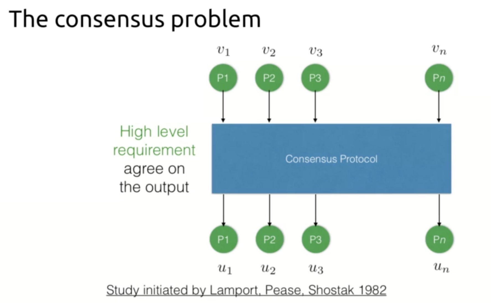
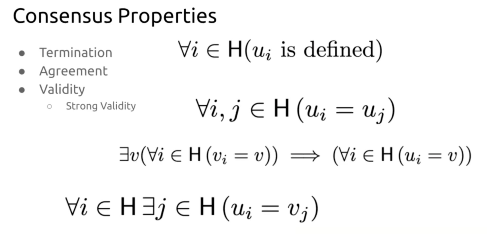

> "Blockchain technology allows for new forms of online governance relying on decentralized infrastructure. In particular, it has enabled the so called Decentralized Autonomous Organizations (DAOs): pieces of software deployed on a blockchain which mediate the interaction of groups of people. Allegedly, their main aim is to facilitate large-scale decentralized cooperation in online communities. In order to do that, they provide governance mechanisms for democratic decision-making in communities. One of them is ”Holographic Consensus”, a voting mechanism intended to filter relevant proposals for large communities. To which extent is Holographic Consensus working as intended, facilitating effective scalable cooperation? In order to validate this method, we analyze the 22 DAO communities and 6000 users from the DAOstack platform, which uses Holographic Consensus in all its DAOs. Our results show that this mechanisms seems to follow the expected behavior, facilitating scalable decision-making in large DAOs."

As DAOs become larger, it is quite easy to see how an unrestricted number of proposals (or even proposals that a majority do not simply care about) could cause issues This would, however, depend on the satisfiable constraints associated with the governance model. For example, if we consider a network consensus protocol (which has a set of satisfiable constraints) to be a type of governance, it implements the following properties (given an honest majority):

* Termination
* Agreement
* Validity
* Strong Validity

These simply are the the constraints that a consensus protocol must satisfy for it to be considered to be effectful, see [[1]](#ref1):

Similarly, any immutable constraints or properties or architectural voting 'protocol' design which is unable to filter irrelevant proposals for large communities **could** lead to issues where the DAO becomes too large and its members are no longer able to effectively vote. This consideration can claim to be overlooked if a Holographic Consensus mechanism is used for voting.

*Unfortunately, I'm not going to be ablle to fully review all the papers I wanted to this week. I have a meeting an a meal later this evening.*

References:

<a href="#ref1" id="ref1">1</a>. Aggelos Kiayias, Lecture 05, 19.10.2020.  
The consensus problem.  
University of Edinburgh