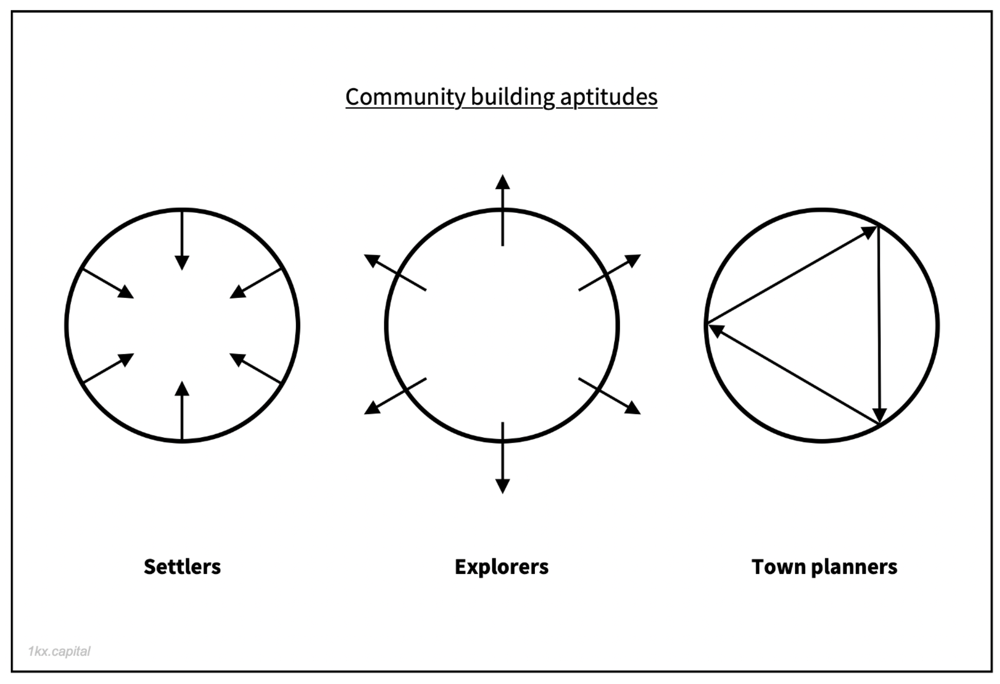

# General Notes on Resources

*Taken from the channel: daos. A library with many resources regarding DAOs.*

**There are rather a lot of resources, but here it goes.**

**Take these notes with a pinch of salt, please.**

**NOTE: All opinions expressed within these notes are representative of the author and the author alone. Zero views are affiliated with any organisation and are completely the authors own views. Do not use any information within this document to base financial decisions or architectural decisions regarding the engineering processes of applications that sit on distributed ledgers which are governed using network consensus protocols.**

*Not at all proofread, essentially free association.*

* [Notes](#n)
* [General Working Summary](#s)
* [Resource List](#r)

*TODO: Tidy Up, Make Less Informal.*

#### Jess Sloss (Seed Club) Presents at DAOs: Disrupting With Code - August'21

* "Tokens give communities superpowers."

*Authors Note: Please explain.*

* Friends With Benefits DAO (Requires 75 Tokens for membership), then you can access a Discord server. TLDR: Token Gating, ownership in the community. Seems kind of cultural.

* Authors note: I don't like the idea of being able to pay for governance, even if additional token votes are weighted using a quadratic function. When considering DAO incentive structures for proposal and voting policies, it would seem that the DAO mechanisms that generate a threshold for proposal acceptance must take into consideration the number of members, the number of engaged members, the DAOs social network topology and co-responding clustering coefficients to detect and effectively avilivate centralised or highly clustered nodes at the social level, as it could be hypothesized that a high degree of social clustering may be representative of a larger degree of centralised power. Furthermore, large-scale DAOs may be vulnerable to Sybil attacks, this would effectively render quadratic voting useless without a gating mechanism, but that gating mechanism should be based on the requirements of the DAO, and the alignment of incentives between the DAO and the individual + potentially a nominal fee for entrance.

* This is why I thought it would be important to have DAOs that have social and technical interfaces thereby creating a network of DAOs that share an average (of similar scale) cardinality of the set of members.

* If you can effectively interface between DAOs such that the number of members within each DAO is kept to an appropriate size, it would seem to me to be the case that the complexity of each item within the set of threat models can be significantly reduced. *(Possibly? again I am no authority within this space, at all).*

> Quote on purchasing governance:  

> "You think all segments of American society have equal and fair access to the system? You can walk into any hearing room you like, yes. One can walk into any hearing room, one can not necessarily write the kind of lobbying cheques that your industry writes, or engage in the level of political contributions that your industry engages in."

* PartyDAO: Bid against whales, probably want to fractionalize the NFT. Again, this raises concerns for me. We're in a fairly unregulated space and money laundering does occur, washing NFTs to hyperinflate their value DOES OCCUR, all kinds of shady stuff could go on with something like this *(my humble opinion)*.

#### COOPER TURLEY of Seed Club, on Valuing Social Tokens

* Social Tokens: Token Gating (Fungible or NFTs, ERC-20 or ERC-721), offers access to a private community.

* Creator Tokens evolve into Community Tokens, sometimes, apparently.

* Content DAOs seem to make sense to me.

* Social Tokens are different to Governance Tokens. Governance managing large amounts of money.

* Social tokens are more grassroots, they transition into governance tokens when serious decisions are required to be made.

* The alignment of incentives between the individual and the collective is important. This is brought up in DAO of DAOs and is coined as Duality Of Incentives. This is integral to maintaining the integrity of the organisation, which is why I have expressed concerns with, for example, grouping securities together and creating financial derivative products whose value is tied to the underlying securities. This may topple the Duality Of Incentives, as shorting a DAO or a set of DAOs that a small, socially organised group participate in actively works against the duality of incentives.

* "Maybe it doesn't make sense to have one threshold for everything, maybe it makes sense to segment that out."

* The community decides on the various 'access levels' for members, essentially creating a hierarchy within the DAO, where you're essentially creating a divide, a sense of status and potentially a large degree of variance in 'wealth' distribution, where wealth is a function of whatever that community considers to be valuable.

* Insofar as voting is not required for everything & allowing small working groups to contribute without going through the voting process, consider the following:

> "In CVS you never ever commit (because branches are SO PAINFUL) until it passes every single test! Then at your company, you have a strict committing rule that says: YOU WILL NEVER EVER COMMIT UNTIL IT HAS PASSED THE WHOLE TEST SUITE. Oh, and by the way, the fact that the test suite takes two hours to run is tough. **You can not afford to commit.** [...] and then in practice, people make one-liner changes and ignore the test suite because they know that one-liner changes CAN'T POSSIBLY BREAK THE SYSTEM."  
>- Linus Torvalds, Talk at Google on Git

* I would like to point out that there is a correlation to be drawn here. However, the affordability of making a change without having it passed through voting shifts the entirety of accountability over to the individual rather than the organisation. This is simply a design decision. Do you trust that individual enough to never, ever make a mistake? Can small working groups afford to make their own decisions? What happens if small working groups do things people don't like using money from the treasury? Again, devil's advocate: it seems as though voting needs to be streamlined when it comes to smaller, simpler decisions, but it still needs to be there; otherwise the organisation will incur inconsistent accountability that could lead to issues. If organisations are not careful, this type of behaviour could result in the DAO failing.

* The more this guy talks about social exclusivity based on token holdings (token gating) that correlate to individual wealth, I cannot help but continue to disagree with these principles, I won't make any further comments publicly.

* This conversation is seated far too deeply in the notion of economic self-interest.

#### CEO's and Experts Hold Q&A Session at DAOs: Disrupting With Code 2021

* FlamingoDAO has a maximum of 99 members.

* realEstateDAO (housing DAO) - nobody really knows what is happening (exciting, right? Until you find yourself in the middle of a lawsuit).

* DAOs generally share knowledge, no one knows what's going on.

* ANON / PSEUDO-ANON DAOs. You probably want to be able to remain anonymous due to lack of regulation, but we require reputation-based mechanisms. It's difficult to put faith in a project when the creators are all anonymous, I feel, at least that it affects the credibility of a project.

#### Mint Season 1 episode 8

> Mint Season 1 episode 8 features Cooper Turley is actively shaping the Creator Economy through projects like Audius, Friends with Benefits, and PleasrDAO. He advises Variant as an operator and investor and works with teams on token launches and governance through Fire Eyes DAO.  

> On this episode, we talk about his recent article mapping out the current DAO landscape. With 100s of DAOs in existence, he argues which ones he thinks will outpace the test of time, his point of view on how crypto is revolutionizing the music industry, why he’s betting big on DAOs, and so much more.  

> I hope you enjoy our conversation.  

> Learn more by visiting: https://adamlevy.io/mint  

* Web3

* CoinVice - Personal / Community social token.  Incentives, Token Rewards and Bounties and NFT business models. Discord Based.

* POAP - Proof-of-Attendance Protocol - NFT Tech - Life Diary - Minting NFTs for Meaningful Events - Crypto Native Communities - Adam Levy.

* Copper T - Pleasure DAO - Friends with Benefits - Fire Ice DAO - Mapping out the current DAO landscape - Crypto + Music Industry.

* Copper T - Music Industry Guy, DJing, etc.

* Marketing, Strategy, Business Development, Point People In The Right Direction.

* Information on the music industry, smart contracts to cut out middle guys, DAOs make sense.

* Covering the DAO landscape article (TODO: FIND THIS ARTICLE).

* Working in the DAO space for 2 - 3 years, 3 - 5 months a lot more traction.

* Copper, a lot of things (RAC, Audius, Many Organisations).

* How do you find the time to manage everything? Lot's of FO-MO in crypto, how do you manage your time: living life, crypto and being a human.

* Paraphrased: 'DAOs contain members, members have roles. Operators - community manager on steroids.'

> Quote of note:  

> "There are so many people across so many working groups across any given DAO that it can be difficult to know what everyone else is working on, so having one given person who acts as the touch-point to really organise everything and keep everyone in check is probably one of the most valuable roles that a DAO has to offer today."

*Authors note (opinion): Look, I am no authority in this space, I've been here for the best part of a couple of weeks. Nevertheless, it would seem to me to be the case that perhaps the lack in the use of tooling or education on such tooling is a problem for the speaker. The aforementioned tools are used by technical individuals all the time: Slack, GitHub, Trello, Jira, Other Atlassian products, shared CalDAV for shared calendars, the list GOES ON). More importantly, this is a problem that can be solved without having to delegate too much control to one 'community manager on steroids' (creating an element of centralisation). At the end of the day, yes it's a consideration for the DAO, how decentralised do they want to be? From an ethical, moral and technical perspective, the answer is quite clear, as decentralised as possible. A practical example: Consider the 'bus factor' - if Joe is responsible for being the community manager on steroids, but tragically gets hit by a bus during either DAO development or simply during DAO maintenance, your organisation has a fairly serious problem. Furthermore, people experience the world as a function of phenomenal consciousness; and with it comes emotions and biases. Through the elimination of those elements by implementing code and effective tooling, you reduce the 'bus factor' to (effectively) zero. Finally, your uptime should then be tending towards 100%.*

#### The Ultimate DAO Report

*Provides links to reports and has some other interesting articles on their page.*

> "It’s bad for intermediaries, and good for everyone else."

If we can get it right, I'm hopeful. But these are radically new concepts and it would seem to be the case that there is a lot of work to do moving forwards.

An example of a voting network topology (A splice of Vote Delegation Data from the recent GitcoinDAO launch, each node is a voter, each edge is a delegation transaction):

It looks as though there is a degree of preferential attachment, as there are highly interconnected nodes and a fair few nodes sitting at the edges, which would make sense in a model that allows for voting delegation.

The above is pretty interesting.

Source: <https://docs.google.com/presentation/d/1fLJvPOvibcCUpJ9ES44_cdoX5Hb7LpDaloGWz5FbUEM>

#### A beginner’s guide to DAOs

> "Another example is Curve DAO building an automated market maker (AMM) that generates fees and provides revenue sharing for token holders that lock their tokens. The longer the Curve token (CRV) is locked for, the greater the amount of voting power and rewards received for the DAO member. Unlike traditional companies where profits are paid out pro rata, this DAO is setup such that voting power and revenue share is weighted according to the length of time a token holder has remained invested."

'Future' use cases:

*I think we're already here with some of this stuff.*

> There are a ton of interesting use cases for DAOs and we are only just at the start of the design space. With DAOs, we’ll be able to experiment with governance systems at a rapid pace to quickly improve on what works and what doesn’t. For example, there could be a DAO that uses futarchy for decision making which would consist of members betting in prediction markets and then using the outcome of those markets to determine the action.  

> We will also see meta-governance when DAOs themselves serve a number of different protocols and receive governance tokens in return. DAOs will start voting and acting as delegators in other DAOs.  

> One possible use case is a DAO where all members are anonymous and can build up reputation in the DAO without having to reveal their identity. This allows members to be on a more even playing field and makes it easier for DAOs to reward individual contributors rather than possibly catering to higher profile members with a large following already.  

> Another interesting use case for DAOs is owning collective NFT art where each member can vote on different attributes of a piece of art and have the overall art piece change depending on individual attributes.  

Source: <https://linda.mirror.xyz/Vh8K4leCGEO06_qSGx-vS5lvgUqhqkCz9ut81WwCP2o>

#### Roles in community building

*Borrowing from Simon Wardley's framework:*

Comparing these roles to a traditional set of business roles and OSS roles.

**The Settlers (operates, focused on steady-state growth and maintenance)**

*(Interpretation of the Author) Project Maintainers & Contributors - not just technical. Multiple skillsets are required.*

> The settlers of a community maintain a community’s core basic functions and facilitates steady state organic growth.  This is also understood as the ‘community manager’.  

> Settlers are responsible for variety of community operations from running community calls, moderating discord and telegram groups, engaging existing community stakeholders, onboarding new community members, working on documentation to anything that enables either existing community members.  

> Settlers as the operational backbone of communities.  

**The Explorers (experiments, focused on growing via leaps and bounds)**

*(Interpretation of the Author) Research & Development - one should take heed to 'moving fast and breaking things' unless, of course, it's contained within one's own sandbox. Furthermore, one should place an expectation of responsibility on oneself when developing critical systems. Thus, it would appear to be of importance to remain vigilant and not to simply 'let this creature evolve'. Authors note: put it this way, if you were (and you are) responsible & should be held accountable for the effects of the systems you (we collectively) push out into the world: is it a good idea to just see how it goes? Perhaps a better approach would be extremely careful design considerations, reel in the excitement about the potential of these systems for a moment and seriously take into consideration the effect that they may have on other people if they're deployed in a production environment hastily - (authors opinion). Furthermore, the execution of adoption usually fails if 'leaps and bounds' are implemented. Whilst innovation can occur with a degree of acceleration (technology parses on technology, intelligence parses on intelligence, thus the speed changes - momentum), for the average individual, the rate at which innovation occurs isn't aligned to the rate at which adoption occurs. (again, authors opinion). In short, research and development, esp. research is extremely important within this domain, so long as the collective assumes an appropriate degree of moral obligation to their clients and assumes that they may very well be held accountable in a court of law in certain circumstances. Although this may not be likely, individuals developing these systems should assume these responsibilities as it is the right thing to do. My humble opinion.*

[Information on the DAO Hack | The University of Edinburgh](https://youtu.be/7M89jAvQmUM)

*Quoted from the original article:*

> In a community, the explorers are the ones focused on experimenting with new opportunities for the community to grow in leaps and bounds.

> The work of an explorer is focused on discovering as well as creating new opportunities for the community to grow as opposed to growing the existing community itself.

> Explorers are the ones working on building up new community distribution channels such as a new community resources, content creation, fostering high value partnerships, relationship building, and conducting customer interviews to analyse greenfield market opportunities.

> Explorers are experimenters and drive growth for a community.

**The Town planners (strategizes, focused on optimizing efforts)**

*(Interpretation of the Author) Business Analysts?*

*Community Managers & Event Organisers. Likely responsible for onboarding and adopting methods to create a smooth experience for individuals who are joining insofar as making it easy to allow them to contribute.*

> The town planners of a community are those that drives the strategy behind how a community should grow and where community building efforts are best allocated. A town planner’s role is understand and discover how to allocate community building efforts and resources to areas of greatest leverage.

> 20% of your efforts will drive 80% of your results

> Crafting the right community development strategy is a process of discovery and iteration. It is shaped and formed over time as a community increasing runs more experiments and are able to observe more feedback cycles around their initiatives around the settlers and explorers.

Obviously some confusion between the desired interpretation and that of the author of this document.

#### DAOs: Absording the internet

> We’re still early when it comes to DAO infrastructure. DAOs have many of the same needs as corporations, but must often deal with greater complexities given their scale, fluidity, and technical stack. That necessitated the emergence of tooling for formation, communication, collaboration, payments, and more. DAOs have a handful of providers to select across these categories, but by and large, choice is limited. We should expect many new entrants to the space in years to come. 

> DAOs have clear vulnerabilities that have yet to be fully addressed. The first DAO was famously hacked, with a bad-actor attempting to siphon off millions in Ethereum. While DAOs are safer today, they carry risks. Contributors often join pseudonymously, meaning reputation capital is not entirely on the line. Furthermore, without sufficient protections, some DAOs are still vulnerable to exploitation.

This is pretty interesting & engaging stuff:

> Beyond the potential for financial gains, DAOs may herald a societal shift with lasting implications. We are, after all, influenced by the organizations in which we operate. In his work, “A Society of Organizations”, sociologist Charles Perrow argued that organizations explain much of the way our world works. He introduced this theory, as follows:  
> 
> [U]nless you are an organizational theorist...your specialty will be treated as a dependent variable; organizations will be the independent variable that shapes political and economic behavior, the stratification system, religion, social psychological processes and history in general.

...

> Ownership

> Rather than concentrating ownership into the hands of founders and investors, DAOs distribute ownership to a variety of stakeholders in an ecosystem, including contributors, users, strategic partners, vendors, and so forth.  

> Essentially, DAOs are owned by the people who create value in them. This is a radical notion and one with real consequence; by expanding beyond the traditional notion of who should “own” an organization, DAOs empower a broad ecosystem to take action and create value on its behalf.

> Organization

> As referenced earlier, DAOs seek to be “autonomous.” Initially, this term referenced DAOs desire to act independently at the organizational level — free from interference from state or private sector actors. 

> While this is true of some DAOs, arguably the more consequential form of autonomy occurs at the individual level. Constituents can join a DAO and choose to contribute in the manner they find most compelling. There may be guidelines, but by and large, stakeholders choose their own labor and self-organize. 

> Again, this is significant. Traditionally, the relationship between individual contributor and overseeing entity is a subservient one — the worker acts in accordance to a company’s demands. That isn’t the case here. DAO “workers” join in where and when they believe they can add value and wish to do so. 

> By taking this approach, DAOs create the conditions for emergent behavior. Complex systems are able to form in a manner that no individual or group could have coordinated top-down. 

Some fairly basic fundamental properties of a DAO.

*All the research I can do until tomorrow.*

####

#### General Notes Summary

Require Updating

*Updated as we go along. EDIT: need to re-update.*

* On-chain voting (MakerDAO)
* Off-chain voting (MakerDAO)
* Web interface (MakerDAO)
* Signal Request (MakerDAO)
* (X)iP (improvement proposal)
* Parameters for setting threshold (on different types of proposals), step function or logistic function?
* The aforementioned Parameters can be modified.
* Modifying parameters is done through voting.
* Note: assuming mass adoption occurs, can we expect users to understand what various 'policies' (which I'm considering to mean domain-specific parameter groupings) will do? For instance, can you expect the average user to understand that modifying the potential significance of modifying particular parameters?
* Potential for social engineering if users are not experienced enough to understand the significance of their vote. 
* Method of streamlining voting: delegating (so, yes, actually you could pass your vote on to a delegate, which I would consider to be a working group). Until you remove your delegation, that working group would have its own internal voting mechanism. Performance of delegated votes should likely be measured. How exactly to do that?
* Reputation-based staking in democratic systems would appear to be a requirement. It's a metric that could be used to evaluate the reliability of delegates.

In my humble opinion, instead of measuring 'strength of membership' through token holdings, 'it' should be measured through reputation and contribution (meritocracy).

General Thoughts

#### Potential Areas Of Interest (Research)

*Potential hypothesises / titles.*

* Effectively Managing Voting Power In Decentralised Autonomous Organisations With Disparities In Governance Token Distribution
* *TODO: Add More - To Be Discussed.*

*These are very general thoughts. Although I have written them in a somewhat academic manner (albeit, the sentences are too long and could be radically improved upon, it's not like I'm trying to get any of this published), they're very much open to peer-review.*

**Voting Power**

The ability to purchase voting power as a non-linear function of governance tokens (quadratic voting variant) would seem to be a good methodology to deter attackers (in a model where reputation is represented as tradable NFTs and governance tokens are highly fungible & carry value), as a higher degree of influence becomes extremely expensive. However, a disparity of wealth between organisational members often exists. These disparities are often due to the ability of highly technical individuals to contribute in ways that provide much higher degrees of value than other organisational members. Whilst it may be considered to be advantageous for those who are able to contribute in many ways to hold more governance power than others, it may also be argued that it promotes notions of class discrimination and social mobility. In addition, if voting power is not capped at all, smaller organisations could be toppled by much larger entities with huge amounts of capital (if highly influential members within the organisation sell their anonymous reputation identifiers and governance tokens are actively traded). Thus, it would appear advantageous to implement a form of logistic voting, thereby allowing large contributors to have a greater effect when casting votes, whilst also promoting diminishing returns, effectively inverting the model of quadratic voting *(as far as I understand it)*. See:

*note: \oplus is just +, fed up of this img to TeX thing.*

LaTeX Mathematical Formula

$ f(x,\gamma) = \frac{1}{1+e^{-x}} $

<small>$ f(x,\gamma) = \frac{1}{1+e^{-x} $</small>

*Yes, I drew it in paint. What you gona do?*

The general idea is: if you're disreputable, you have less voting power. 

**That's all for now folks. Should probably make some changes here. If you're disreputable, should you have any voting power? Further, it's probably not quite the correct curve, although we can throw in some more parameters and think a little bit more about this when there is more time. You get the idea.**

**EDIT: Probably need to do some more reading on some of these voting mechanisms.**

# Resources:

**Articles, Videos & Spotify Links:**

* [Jess Sloss (Seed Club) Presents at DAOs: Disrupting With Code](https://youtu.be/PgRS52lNizQ)
* [COOPER TURLEY of Seed Club, on Valuing Social Tokens](https://youtu.be/kiSb-D_ayxo)
* [CEO's and Experts Hold Q&A Session at DAOs](https://youtu.be/1Wnt5fi5GKQ)
* [DAO Landscape & Full-Time DAOs - Cooper Turley](https://open.spotify.com/episode/41JFs6bMjVZjwwnuWs29fj)
* [The Ultimate DAO Report - Bankless DAO x Gitcoin](https://newsletter.banklesshq.com/p/the-ultimate-dao-report)
* [A beginner’s guide to DAOs - Linda Xie](https://linda.mirror.xyz/Vh8K4leCGEO06_qSGx-vS5lvgUqhqkCz9ut81WwCP2o)
* [What is a DAO and what is it for? - DAO Haus](https://daohaus.club/docs/users/intro-dao/)
* [Roles in community building - Pet3rpan](https://www.pet3rpan.net/blog/roles-in-community-building)
* [The Rise of DAOs](https://medium.com/fitzner-blockchain-consulting/the-rise-of-daos-61864545594b)
* [DAOs: Absorbing the Internet](https://www.readthegeneralist.com/briefing/dao)
* [High Level Fusion Process Overview
](https://docs.google.com/presentation/d/1UFDynL3oJDdL89V71lnG2AV4ZaceGRc_fFrvOWO4n5w/edit#slide=id.g100800953e8_0_1043)
* [What is a DAO? The Defiant Guide](https://youtu.be/j91PcO9Fk5Y)
* [Proof of Decentralization](https://t.co/ygW6BaIwAp?)
* [The best articles, podcasts and resources to learn about investing in decentralized autonomous organizations (DAOs)](https://blockworks.co/the-investors-guide-to-daos/)
* [What is OlympusDAO? - OHM Explained with Animations](https://youtu.be/o699i_l_qy8)
* [Introducing Euphoria: an algorithmic reserve currency protocol on Harmony](https://medium.com/venomdao/introducing-euphoria-an-algorithmic-reserve-currency-protocol-on-harmony-7581d17c38e8)
* [The Importance of DAO Tooling for Social Cohesion](https://ff.mirror.xyz/5DKTQ81NR3u_CyZIPWlAcUMstYyVDEYj6nOyZKx1ZuI)
* [A Primer on DAOs](https://open.spotify.com/episode/37gt1KQucQddi81M8T95yk?si=-yubO0HWQbuFKglnx87BFg)
* [3 Pillars of Contributor Mental Health In DAOs (and the Metaverse)](https://twoplus.mirror.xyz/_4JYbrI1U85SGf2_J7zcHE48JkP9-R2dFnl--DNHCBM)
* [Decentralized Autonomous Organizations (DAOs) Canon](https://future.a16z.com/dao-canon/)
* [What Are DAOs?](https://open.spotify.com/episode/1Oco27LMCspwPgYpah7Azi?si=GNUMaEiyRGa5cdmOGaoiUQ&utm_source=copy-link)
* [How to solve the apathy problem in DAOs](https://open.spotify.com/episode/6fFwHouWleD7j7Dlgun0tb?si=95eZL8BTT6CHK4gY12HdGA&context=spotify%3Ashow%3A09k4pnFm6WokaszuoeZ6yf)
* [WHAT CO-OPS AND DAOS CAN LEARN FROM EACH OTHER](https://www.fwb.help/wip/what-co-ops-and-daos-can-learn-from-each-other)
* [Requesting Compensation and Voting](https://docs.bisq.network/compensation.html)
* [Restructuring DAOs For Fair Compensation Mechanisms, Reputation and Efficiency](https://opendefi.medium.com/restructuring-daos-for-fair-compensation-mechanisms-reputation-and-efficiency-9865a88e80c7)
* [A Big Test for DAOs: Honing New Compensation and Contribution Practices](https://thedefiant.io/a-big-test-for-daos-honing-new-compensation-and-contribution-practices/)
* [Experiment in the HAUS: A new Contributor Compensation Program](https://daohaus.substack.com/p/-experiment-in-the-haus-a-new-contributor)
* [How to DAO 301: Contributor Rewards](https://creators.mirror.xyz/Le68ptgaqsBh1g6w8UqqVL2kIrA_Lqn37bELMO-W_-0)
* [DAO Maker Compensation Plan](https://medium.com/daomaker/dao-maker-compensation-plan-b7a76a312c30)
* [Why DAOs Change Everything](https://www.getrevue.co/profile/lzrs/issues/why-daos-change-everything-892091)

**Tweets:**

*TODO: Go through these and name them appropriately.*

* ["Some of the biggest demands I’m seeing from DAOs right now"](https://twitter.com/JulzRoze/status/1457709126893592579?t=0LEMCp75n7KrTAIs9pAXSQ&s=09)
* ["What makes a good DAO?"](https://twitter.com/GabsCrypto/status/1461800430057492483?t=XeATZPUhUdgH6909vt0UTg&s=19)
* ["What makes a good DAO? (cont’d)"](https://twitter.com/GabsCrypto/status/1461802745397231630?t=ZUf-unRMUX7bBOYes6sXhw&s=19)
* ["What makes a good DAO? (cont’d)"](https://twitter.com/GabsCrypto/status/1461803945546891275?t=TYUQcl4r6GNCb3CTBmUteg&s=19)
* ["On Chain is a must!"](https://twitter.com/Welikethetrees/status/1461806386535444497?t=wPDjFR8rei684b-l4uCqeg&s=19)
* ["Many have predicted that DAOs will eclipse centralized organizations. How?"](https://twitter.com/Cooopahtroopa/status/1465391570144927757?t=fqfEZMiOObQNYCOo9kFh9A&s=19)
* ["Why onboarding people into a DAO is so hard"](https://twitter.com/gideonro/status/1470431510763167746?s=21)
* ["DAOs superpower is fluid, hierarchical leadership."](https://twitter.com/jessewldn/status/1470406564582498315?s=21)
* ["You cannot wait for someone to tell you what to work on in a DAO, You will wait forever."](https://twitter.com/chaserchapman/status/1460257486888448003?s=20)
* ["Consent is the most underrated topic in DAOs right now."](https://twitter.com/chaserchapman/status/1471904079127347200?t=j2jh3N6cel7KNJh6rsDkTA&s=19)
* ["DAOs don't only represent a new way to organize, they show us a more human way to work together."](https://twitter.com/stefdelev/status/1475599799412006920?t=RHmMSt54E3gTbQOnr03DYA&s=19)
* ["10 Lessons from DAO land for the new year"](https://twitter.com/ShapeShiftCOO/status/1477461168801280004?t=dsE0MEEk6PnrCfVlyaW8_w&s=19)
* ["New post: A deep dive into Community Contribution Opportunities (CCOs)"](https://twitter.com/nowdaoit/status/1479153438311137280?t=RvPkASy1dPgvh0rUE1FLxQ&s=19)
* ["Decentralization maximalism might work for protocols (like Bitcoin or Ethereum), But it does not work in human systems (like DAOs)"](https://twitter.com/chaserchapman/status/1483124528679211022?t=QwFnZ4N50GUaXGFJtJYyLQ&s=19)
* ["Super podcast by @mrjasonchoi and @Cooopahtroopa about DAOs."](https://twitter.com/isaac_mung/status/1477588748799991811?t=0zRECb99Y5VTGtHEu-1xHg&s=09)
* ["Many projects have adopted 'DAO' as a last name - does this name-change really mean decentralization & transparency for you?"](https://twitter.com/nowdaoit/status/1484577489837903872?t=yRUY02xRe6jgWsDU4RkuFg&s=19)
* ["great pod on consent-based gov by @chaserchapman @aarondignan @rodneyevans919"](https://twitter.com/JulzRoze/status/1485637918236590085?t=y8OQmdxoRX1FpXwwEvEXmg&s=19)

**Quotes of Note:**

> TCT — 11/10/2021  
> DAO  
> - Usually flat, and fully democratized.  
> - Voting required by members for any changes to be implemented.  
> - Votes tallied, and outcome implemented automatically without trusted intermediary.  
> - Services offered are handled automatically in a decentralized manner (for example distribution of philanthropic funds).  
> - All activity is transparent and fully public.   

**Papers:**

*TODO: Add increasing large list of papers to this document.*
